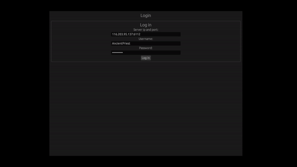

# pvpgn-chat

This is a test project in Rust programming language to connect to a pvpgn server and receive packages.

## To test

** Observation: `Server` needs to be ip+port

#### `cargo run`

## Not yet there
~~* Submit on enter on message input~~
* Styles
* Icons
* Code beautify
* Right click on user
* Message styles in main panel
* A lot of error handling
* ...

It's full of bugs, but it's a working POC.
